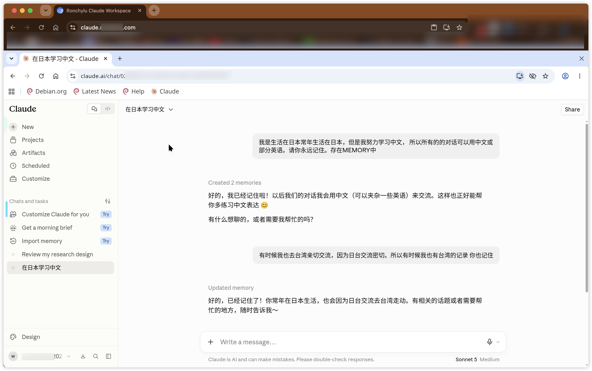
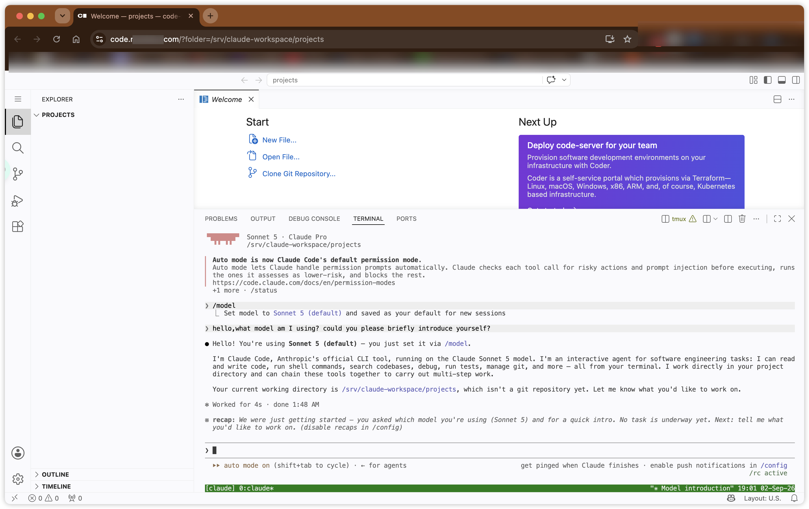
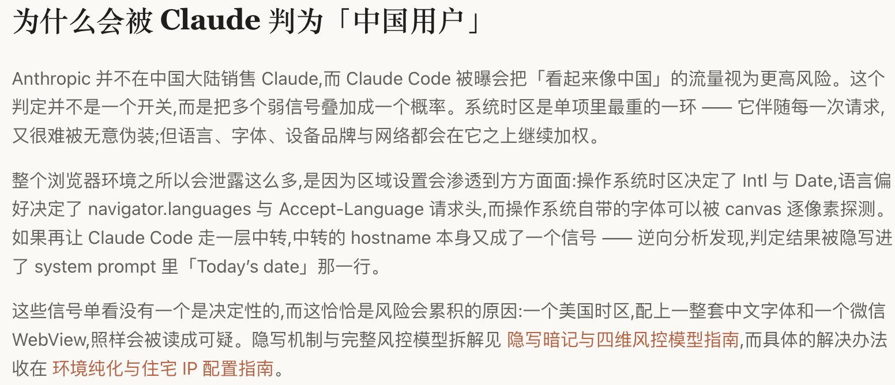

# Remote Claude Workspace

将 Claude 官方网页和官方 Claude Code 部署到远程 Linux 服务器上的固定工作区方案。

用户只需要在本地浏览器访问两个受保护的网页：一个显示远程 Chromium 画面，另一个提供 code-server 终端；浏览器 Profile、项目文件、登录状态和 Claude Code 进程都保留在服务器上。

## 使用效果

部署完成后，可以通过两个受保护的网页入口使用这套远程工作区：

### Claude 网页版

远程 Chromium 会直接打开 Claude 官方网页，浏览器 Profile 和登录状态都保留在服务器上。

### Claude Code

通过 code-server 进入服务器终端，并使用 tmux 保持 Claude Code 会话。即使关闭本地浏览器，后台任务也可以继续运行。

## 写在前面
我曾有过 6 个 Claude 账号被封的经历，其中包括 2 个 Free、1 个 Pro 和 3 个 Max。这个仓库也是在不断试用和踩坑的过程中，逐步整理出来的。

如果你想先了解当前 IP 是否可能触发 Claude 的风控，可以使用这个网站进行评测：[fuck-claude.vercel.app](https://fuck-claude.vercel.app/zh/)。

本文默认你已经准备好一台海外服务器，ARM、AMD64 或 Intel 架构均可，操作系统不限。

这里分享几点实际使用中的经验：

1. 建议直接在 VPS 上完成 Claude 账号的注册和首次登录。
2. 如果使用 Apple 设备支付 Pro 订阅，登录设备（例如手机）的时区和网络出口最好与 VPS 所在国家保持一致。两者差异较大时，账号更容易触发验证；我之前的两个 Free 账号就曾在注册后很快被封禁。
3. 注册、登录和支付流程尽量连续完成。支付成功后，可以卸载手机端的 Claude；之后只需确保 Apple 账户余额足够支付每月订阅即可。

> [!IMPORTANT]
> 在运行任何命令、把执行 Prompt 交给 AI 或修改服务器之前，必须完整阅读本 README.md 和 [AGENTS.md](AGENTS.md)。未读完前不要执行部署操作。

> [!NOTE]
> 本项目只提供“固定远程工作区”的工程方案，不保证账号永不触发验证，也不用于绕过地区限制、封禁或平台审核。

它适合经常更换设备或网络、希望把工作环境固定下来的人。它不是 Claude 的 API 中转站，不反向代理 Claude.ai，也不是绕过地区限制或平台封禁的工具。

## 为什么需要固定工作区

Anthropic 没有公开完整的风控规则，所以不能声称知道某个账号“必封”或“必不封”。从实际使用现象看，服务可能综合判断：

- IP 的国家、ASN、稳定性和网络路径；
- 浏览器 Profile、Cookie、设备和 OAuth 会话是否连续；
- 短时间内的登录地点、设备和账号切换；
- 使用模式、并发行为、账号与付款资料等其他信号。

如果今天用本地 Chrome、明天换无痕窗口、后天又换另一个节点，服务端看到的可能是不同设备、不同 IP 和不连续的会话。固定一个远程 Profile 和一个长期服务器出口，可以减少这类环境漂移，但不能保证账号永不触发验证。

## 这个项目具体做什么

项目把两个官方客户端放到服务器上：

1. LinuxServer Chromium 直接打开官方 https://claude.ai，用户看到的是画面串流；
2. code-server 提供浏览器终端，终端里运行官方 Claude Code，代码和命令都在服务器执行；
3. Cloudflare Access 负责身份和 MFA，Cloudflare Tunnel 负责把本机回环端口安全带到浏览器；
4. 工作区使用独立目录、Docker network、systemd 服务和资源限制，不触碰原有 Caddy、Docker、数据库和入口服务。

请求路径如下：

~~~text
本地浏览器
  -> Cloudflare Access（邮箱/身份组 + MFA）
  -> Cloudflare Tunnel
  -> 服务器 127.0.0.1:<BROWSER_PORT>
  -> 远程 Chromium 画面串流
  -> 官方 https://claude.ai

本地浏览器
  -> Cloudflare Access（邮箱/身份组 + MFA）
  -> Cloudflare Tunnel
  -> 服务器 127.0.0.1:<CODE_PORT>
  -> code-server
  -> 服务器上的官方 Claude Code
  -> Anthropic
~~~

Claude 网页的 Cookie、浏览器 Profile、DNS、TLS 和网页请求留在服务器；Claude Code、项目文件和 Shell 也留在服务器。断开本地浏览器不会结束 tmux 中的任务。

本地机场或其他网络中继只用于访问 Cloudflare hostname，不应写入服务器的 HTTP_PROXY、HTTPS_PROXY、ANTHROPIC_BASE_URL，也不应把 Claude OAuth 交给 CPA、CLIProxyAPI 或其他第三方 relay。使用前仍需确认 Anthropic、Cloudflare、云厂商、网络服务商和当地法律允许这种方式。

## 默认方案：少改动、可回滚

默认使用当前 SSH 登录的非 root 用户运行 code-server、项目和 Claude Code，不自动创建新 Linux 用户。这样部署步骤少，也不会触碰现有账号、服务和权限结构。

> [!IMPORTANT]
> 这是“少改动”的默认模式，不是强安全隔离。服务器上有敏感业务或多个不可信用户时，应明确选择 dedicated-user 模式；任何模式都必须先做旧服务基线和可回滚备份。

默认必须遵守：

- 新服务只写入 /opt/claude-workspace、/srv/claude-workspace、专用 systemd 单元和专用 Docker network。
- Chromium 只发布到 127.0.0.1，默认端口是 3010；code-server 默认端口是 8080。端口被占用时改用其他未占用的回环端口，不抢占旧服务。
- Chromium 不使用 host network，不挂载 Docker socket、SSH key、旧项目目录或数据库目录。
- Cloudflare Tunnel 只指向回环端口，不经过现有 Caddy/Nginx，不创建指向服务器 IP 的 A/AAAA 记录。
- 先记录旧容器、网络、监听端口、入口配置、磁盘和内存，再启动任何新服务。
- 不执行全局 docker compose down、docker system prune、ufw reset、nft flush ruleset、系统级大范围升级或修改旧服务的 systemd/Caddy 配置。
- 每个工作区服务有资源上限；失败时只停止工作区，不联动旧业务。
- 运行时 .env、密码、Tunnel credentials、浏览器 Profile、OAuth 状态和日志都放在仓库外。

默认模式的边界是“运行和网络隔离”，不是强安全边界：当前管理员用户通常仍有 sudo 权限。如果服务器上有其他用户或敏感业务，请启用下面的可选多账户模式。

## 你需要准备什么

1. 一台 Ubuntu 22.04/24.04 ARM64（aarch64）服务器。4 GiB 内存是下限，8 GiB 以上更舒服；磁盘至少预留 30 GiB。
2. 一个已接入 Cloudflare 的域名，准备两个没有冲突的子域名，例如 `claude.example.com` 和 `code.example.com`。
3. Cloudflare Zero Trust 权限，可以创建两个 Self-hosted Access 应用和一个 locally-managed Tunnel。
4. Access 使用的邮箱/身份组和 MFA。
5. 服务器上的非 root SSH 管理账号，并且能够使用 sudo。
6. 符合 Anthropic 服务条款的 Claude 账号。网页端使用订阅账号；Claude Code 使用官方支持的登录方式，不填 API relay 地址。

## 最快开始

在服务器上执行只读预检：

~~~bash
git clone <REPOSITORY_URL> <REPOSITORY_DIR>
cd <REPOSITORY_DIR>
chmod +x scripts/check.sh
./scripts/check.sh preflight
~~~

然后把下面的 Prompt 原样复制给具有终端权限的 AI（Claude Code、Codex 或其他可靠的 coding agent）。Prompt 已经包含“先检查、再备份、遇到冲突就停”的规则；不需要把真实密码、Token 或 Cookie 粘贴给 AI。

## 可直接复制给 AI 的执行 Prompt

~~~text
你是这台 Ubuntu ARM64 服务器的部署代理。请在当前仓库目录执行 Remote Claude Workspace，目标是：
1. 远程 Chromium 访问官方 https://claude.ai，并通过浏览器画面串流使用；
2. code-server 提供浏览器终端，在服务器上运行官方 Claude Code；
3. 两个服务只监听服务器回环地址，再由独立 Cloudflare Tunnel 暴露；
4. 不使用 Anthropic API relay、CPA、CLIProxyAPI、New API、LibreChat、Cookie 导入或浏览器指纹伪装。

先完整阅读当前仓库的 AGENTS.md 和 README.md，再执行：
./scripts/check.sh preflight

执行纪律：
- 默认使用当前 SSH 登录的非 root 用户（existing-user 模式）。只有我明确说“dedicated-user 模式”时，才创建 claude-ws 等新用户。
- 绝不使用 root 运行 Chromium、code-server 或 Claude Code。若当前是 root 登录，先让我提供一个现有非 root 管理账号。
- 先保存旧 Docker 容器、network、监听端口、Caddy/Nginx 状态、磁盘、内存和 systemd 状态。不要改变旧服务的镜像、volume、network、端口、启动时间或配置。
- 只允许新增 /opt/claude-workspace、/srv/claude-workspace、名为 claude-workspace 的 Docker network、名为 claude-workspace-chromium 的容器，以及约定的三个 systemd 单元。默认数据目录为 /srv/claude-workspace，root 管理配置目录为 /opt/claude-workspace。
- 先确认 3010 和 8080 未被占用；被占用就选择其他未占用的 127.0.0.1 端口，并把端口告诉我。禁止绑定 0.0.0.0、host network 或旧 Docker network。
- 不执行 docker compose down（除非明确指定工作区 compose 文件），不执行 docker system prune、ufw reset、nft flush ruleset、系统级大范围升级，也不修改旧 Caddy/Nginx、sshd、Docker daemon 或数据库。
- 缺少依赖时只安装官方需要的最小软件包；如果 apt 操作会升级无关生产服务，先停下来询问我。
- Chromium 使用官方 LinuxServer ARM64 镜像，固定 tag 和 digest，不能使用 latest。code-server、cloudflared 和 Claude Code 使用官方 ARM64 发行版/安装来源并记录版本和 SHA-256。
- 生成的生产配置和密钥必须在仓库外，权限最小化。不要在输出、Git、截图或聊天中显示密码、OAuth、Cookie、Token、私钥、完整环境变量或 credentials JSON。
- Chromium 通过独立 bridge network；关闭分享、协作、文件传输、远程命令、麦克风和不需要的桌面功能。给 Chromium、code-server、cloudflared 设置合理 CPU、内存、PID 和日志上限。
- code-server 使用密码认证和回环监听；Claude Code 不设置 ANTHROPIC_API_KEY、ANTHROPIC_BASE_URL、ANTHROPIC_AUTH_TOKEN、CLAUDE_CODE_OAUTH_TOKEN，也不继承 HTTP_PROXY/HTTPS_PROXY/ALL_PROXY。
- Claude Code 在 /srv/claude-workspace/projects 中运行，并用 tmux 保持长任务。不要复制其他设备的 ~/.claude、~/.claude.json、Cookie 或 OAuth 状态。
- 创建 Cloudflare Access 应用时使用默认拒绝，只允许我的邮箱/身份组并要求 MFA。Tunnel 使用独立 locally-managed credentials file，只连接工作区回环端口，不经过现有 Caddy，也不创建源站 A/AAAA 记录。
- Cloudflare 控制台登录、Access 策略确认、Tunnel 授权、官方 Claude 网页登录和 Claude Code OAuth 登录属于人工步骤。到这些步骤时给出清晰的操作说明并暂停，不要索要或代填秘密。
- 每完成一个阶段都运行本地健康检查、监听检查、Docker network 检查和旧服务回归；任一旧服务发生重启、配置变化、端口变化、健康状态变化或资源越线，立即停止并报告。
- 完成后给出：访问地址占位符、实际回环端口、服务状态、备份位置、回滚命令和仍需人工完成的登录步骤。不要输出秘密。

如果我明确要求 dedicated-user 模式：
- 创建无 sudo/docker/lxd/adm 附加组的 claude-ws；
- 将登录 Home 与运行 HOME 分离，并只让它访问工作区目录；
- 先对旧服务父目录做 ACL 预演和反向验证，再考虑按 UID/bridge 加 nftables 出站限制；
- 不递归修改旧服务的 owner/mode，不让旧业务依赖工作区守卫；
- 专用模式的每一步都必须可单独回滚。
~~~

AI 不能代替你的三个手动确认：Cloudflare Access 策略、官方 Claude 登录、以及最终旧服务零漂移检查。遇到端口或权限冲突时，让 AI 停止比让它“猜一个修复”更安全。

## 需要手动配置的步骤

### 1. Cloudflare Access

在 Zero Trust 中创建两个 Self-hosted 应用：

> [!IMPORTANT]
> 先创建默认拒绝的 Access 应用并验证 MFA，再创建 Tunnel route；不要先把未认证的后端暴露出去。

| 应用 | hostname | 策略 |
| --- | --- | --- |
| Claude Browser | `claude.<ZONE>` | 只允许自己的邮箱/身份组 + MFA |
| Claude Code | `code.<ZONE>` | 只允许自己的邮箱/身份组 + MFA |

不要使用 Everyone、Bypass 或临时公开策略。先创建 Access 应用，再创建 Tunnel route。

### 2. Cloudflare Tunnel

使用一个独立 locally-managed Tunnel：

- `claude.<ZONE>` -> `http://127.0.0.1:<BROWSER_PORT>`
- `code.<ZONE>` -> `http://127.0.0.1:<CODE_PORT>`
- 兜底 -> http_status:404

Tunnel credentials 放在服务器受限目录，由专用 cloudflared 用户读取。不要把长期 Tunnel Token 写进命令行或仓库。DNS route 应该指向 Tunnel，不应该指向服务器 IP。

### 3. 首次网页登录

打开 `https://claude.<ZONE>`，通过 Access 和 Chromium 第二层认证后，在远程 Chromium 内只访问 `https://claude.ai`。登录成功后让 AI 重启 Chromium 并确认 Profile 持久化。

### 4. 首次 Claude Code 登录

打开 `https://code.<ZONE>`，进入 `/srv/claude-workspace/projects`，连接或创建 tmux：

~~~bash
tmux new-session -A -s claude
claude auth login
claude auth status
~~~

如果 CLI 显示登录 URL，把它复制到远程 Chromium 的地址栏完成授权，不要在本地另起 Claude Code，也不要把回调地址改成公共 URL。

### 5. 在中国或其他不稳定网络中使用

本地机场/中继只配置在本地设备，用来访问 https://claude.<ZONE> 和 https://code.<ZONE>。服务器上的 Chromium、code-server 和 Claude Code 不要继承本地代理环境。这样本地网络变化不会改变 Claude 官方请求的服务器出口，但仍然不代表平台政策或地区限制被绕过。

## 日常使用

- 网页端：只打开 `https://claude.<ZONE>`，不要在多个本地 Profile 之间混用同一账号。
- Code：打开 `https://code.<ZONE>`，在 code-server 终端使用同一个 tmux 会话。
- 健康检查：只检查 systemd 状态、Chromium health、code-server healthz、Tunnel ready 和回环监听，不用真实模型请求做心跳。
- 备份：至少备份 /srv/claude-workspace/projects、浏览器 Profile、Claude Code 状态、/opt/claude-workspace 和 Tunnel credentials；OAuth/Cookie/密码只能进入加密备份。
- 升级：一次只升级一个组件，先备份和记录版本，再做 ARM64 预检、回环验收和旧服务回归。

## 可选：Linux 多账户强隔离

默认不启用，因为它会增加用户、ACL、systemd 和回滚复杂度。

以下情况建议启用：

- 服务器同时运行多个不应被工作区读取的业务；
- 需要把项目文件、Claude Code 状态和原有服务彻底分开；
- 不希望 code-server 终端继承现有管理员账号的文件权限。

让 AI 使用 Prompt 中的 dedicated-user 模式。它会创建专用 claude-ws 用户、分离登录 Home/运行 HOME、最小组权限、旧目录 ACL 和可选 nftables egress guard。该模式仍然不会修改旧容器或把旧服务停掉；但 ACL 和防火墙属于高风险变更，必须逐步验证并保留回滚点。

## 出问题时怎么回滚

1. 先从 Cloudflare 删除或停用两个 Tunnel route。
2. 停止 cloudflared-claude-workspace.service、code-server-claude-workspace.service 和 claude-workspace-chromium.service。
3. 只对工作区 compose 执行 docker compose down，不要加 -v。
4. 恢复工作区配置、systemd 单元和专用 network；不要删除浏览器 Profile、OAuth 状态或项目数据。
5. 对比部署前后的旧容器、network、监听端口、Caddy/Nginx 和资源状态。确认旧服务未被重启或改变后再结束排障。

## 开源前

仓库只应包含 README、AGENTS.md、检查脚本和不含生产值的说明。发布前扫描：

~~~bash
git diff --check
rg --hidden --glob '!.git' -n -i \
  '真实域名|真实服务器|private.?key|api.?key|oauth|token|secret|password|credentials' .
git rev-list --all --objects
~~~

所有真实域名、IP、邮箱、Tunnel ID、Cookie、OAuth、密码、API Key、SSH key、生产 digest 和运行时目录都必须留在仓库外。不要把本地机场配置或服务器备份提交到 GitHub。

## 文件

- AGENTS.md：AI 执行纪律和安全边界。
- scripts/check.sh：只读预检和验收。
- LICENSE：项目许可。
